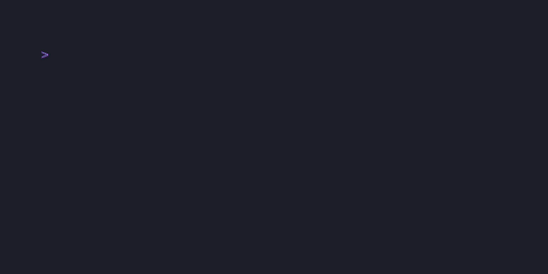

# sigye

[](https://crates.io/crates/sigye)
[](https://github.com/am2rican5/sigye/blob/main/LICENSE)
[](https://ratatui.rs)

A beautiful terminal clock with ASCII art fonts.



## Features

- **40 bundled FIGlet fonts** - From classic Standard to stylish Star Wars
- **14 color themes** - Including rainbow and gradient effects
- **12/24 hour format** - Toggle with a single keypress
- **Live settings preview** - See changes before saving
- **Persistent configuration** - Settings saved automatically
- **Custom font support** - Add your own FIGlet fonts

## Installation

### From crates.io

```bash
cargo install sigye
```

### From source

```bash
git clone https://github.com/am2rican5/sigye
cd sigye
cargo install --path crates/sigye
```

## Usage

```bash
sigye
```

## Keybindings

| Key | Action |
|-----|--------|
| `q` / `Esc` | Quit |
| `t` | Toggle 12/24 hour format |
| `c` | Cycle color theme |
| `s` | Open settings dialog |

### Settings Dialog

| Key | Action |
|-----|--------|
| `↑` / `k` | Previous field |
| `↓` / `j` | Next field |
| `←` / `h` | Previous value |
| `→` / `l` | Next value |
| `Enter` | Save settings |
| `Esc` | Cancel |

## Configuration

Configuration is stored at `~/.config/sigye/config.toml`:

```toml
font_name = "Standard"
color_theme = "Cyan"
time_format = "TwentyFourHour"
```

### Custom Fonts

Place FIGlet font files (`.flf`) in `~/.config/sigye/fonts/` and they will appear in the settings dialog.

## Color Themes

### Static Colors
Cyan, Green, White, Magenta, Yellow, Red, Blue

### Dynamic Gradients
- **Rainbow** - Horizontal rainbow spectrum
- **Rainbow V** - Vertical rainbow
- **Warm** - Red to Orange to Yellow
- **Cool** - Blue to Cyan to Green
- **Ocean** - Dark blue to Cyan to Teal
- **Neon** - Magenta to Cyan (synthwave)
- **Fire** - Red to Orange to Yellow

## Bundled Fonts

3D-ASCII, Acrobatic, Alligator, Alphabet, ANSI Regular, ANSI Shadow, Avatar, Banner, Bell, Big, Big Money-ne, Block, BlurVision ASCII, Chunky, Colossal, Doh, Doom, Electronic, Epic, Graffiti, Ivrit, Larry 3D, Lean, Mini, Mono 9, Mono 12, Ogre, Poison, Puffy, Rebel, Rectangles, Script, Shadow, Slant, Small, Speed, Standard, Star Wars, Terrace, Tmplr

## License

Copyright (c) am2rican5

This project is licensed under the MIT license ([LICENSE](./LICENSE) or <http://opensource.org/licenses/MIT>)
